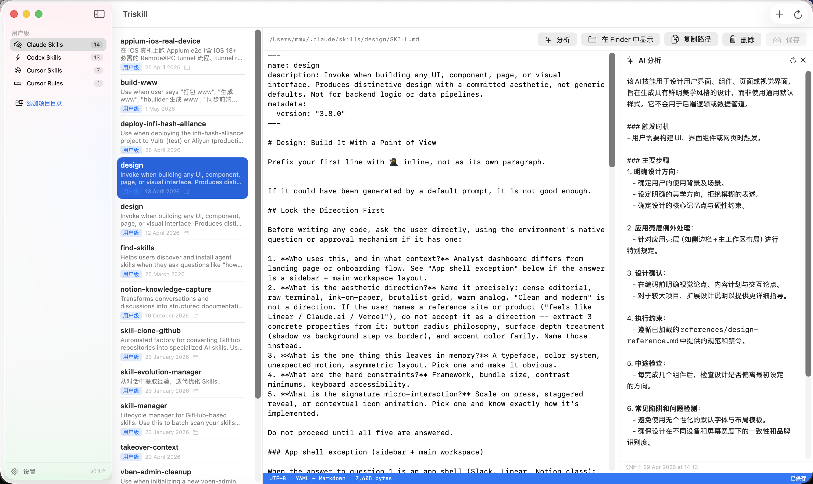

# Triskill

一个 macOS 原生 App，用来集中管理你在多个 AI 编程工具里散落的 **Skills / Rules** 文件。支持 Claude、Codex、Cursor 三家工具的用户级与项目级目录，并可调用 GPT 对 skill 内容进行结构化解读。

> 包名 / 仓库名为 `AISkillManager`，App 显示名为 **Triskill**。

## 产品布局



三栏式布局：左侧来源/项目导航，中间当前来源下的 skill 列表，右侧为详情编辑器；顶栏点击「AI 分析」可拉出右侧抽屉查看结构化解读。

## 功能特性

- **统一管理四类来源**
  - Claude Skills： `~/.claude/skills/`
  - Codex Skills： `~/.codex/skills/`
  - Cursor Skills： `~/.cursor/skills/`
  - Cursor Rules： `~/.cursor/rules/*.mdc`
- **用户级 + 项目级两种 scope**：可把任意本地项目目录登记为「项目」，分别浏览其下的 skill / rule。
- **YAML Frontmatter 解析**：自动从文件头读取 `name` / `description`，列表与详情同步展示。
- **内置编辑器**：原子写入 (`AtomicWriter`)，避免半写状态；可新建、编辑、移入废纸篓。
- **AI 分析抽屉**：调用 OpenAI Chat Completions，对当前 skill 输出固定结构的「用途 / 触发时机 / 主要步骤」摘要，结果落盘缓存，下次切换即时可见。
- **偏好持久化**：API Key、模型、项目列表持久化到 `~/Library/Application Support/Triskill/preferences.json`。

## 系统要求

- macOS 14.0+
- Xcode 15+ / Swift 5.9
- [XcodeGen](https://github.com/yonaskolb/XcodeGen)（用于从 `project.yml` 生成工程）

## 构建与运行

```bash
# 1. 生成 Xcode 工程（仅在 project.yml 变更后需要）
xcodegen generate

# 2. 命令行构建（Release）
xcodebuild \
  -project AISkillManager.xcodeproj \
  -scheme AISkillManager \
  -configuration Release \
  -derivedDataPath build \
  build

# 3. 启动
open build/Build/Products/Release/Triskill.app
```

也可以直接在 Xcode 里打开 `AISkillManager.xcodeproj`，选中 `AISkillManager` scheme 后 ⌘R 运行。

## 使用

1. 启动 Triskill，左侧 Sidebar 默认展示 4 个用户级来源。
2. 通过侧栏底部「+ 添加项目」选择本地仓库目录，即可把它作为项目级 scope 加入。
3. 选中具体 skill / rule，右侧详情区可直接编辑、保存或删除（移入废纸篓）。
4. 在「设置」中填入 OpenAI API Key 并选择模型（默认 `gpt-5.5`），即可在详情区使用 **AI 分析** 抽屉。
5. 分析结果按 skill 维度缓存；切换回已分析过的 skill 会自动展示，无需重复请求。

## 项目结构

```
AISkillManager/
├── App/                  # AppRoot，应用入口
├── Models/               # SkillItem / Project / SourceKind / SourceScope
├── Repositories/         # 四类来源 + DirectorySkillRepoBase 抽象
├── Infrastructure/       # AtomicWriter / YAMLFrontmatter / AnalysisService / PreferencesStore / AnalysisCacheStore
├── ViewModels/           # AppStore / DetailEditorVM / AnalysisStore / ProjectRegistry
├── Views/                # SidebarView / ItemListView / DetailView / NewItemSheet / AnalysisDrawer / SettingsSheet
└── Resources/            # Assets.xcassets

docs/                     # 设计稿、实现 plan
AISkillManagerTests/      # 单元测试 + Fixtures
project.yml               # XcodeGen 配置
```

## 数据与隐私

- 所有 skill 内容均在本地文件系统读写，不会上传。
- 仅在你点击 **AI 分析** 时，才会把当前 skill 的 raw content 通过 HTTPS 发送给 OpenAI Chat Completions API。
- API Key 仅保存在本机的偏好文件中。

## License

[MIT](./LICENSE)
